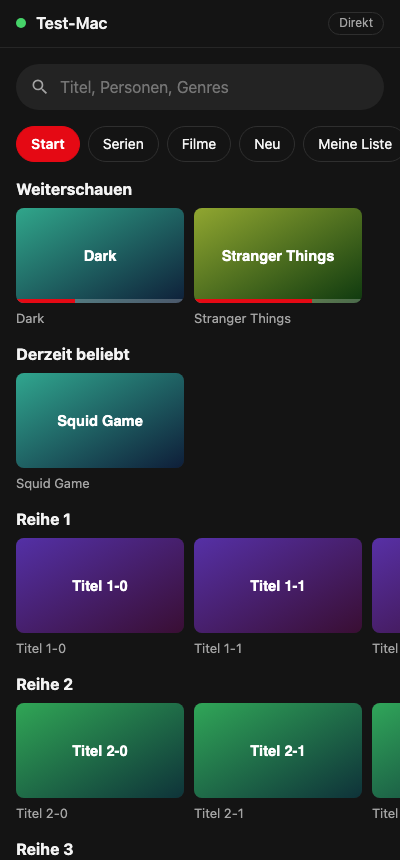
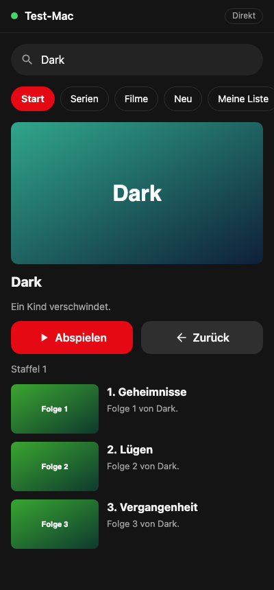
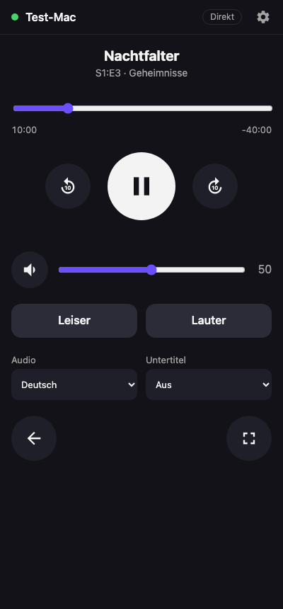
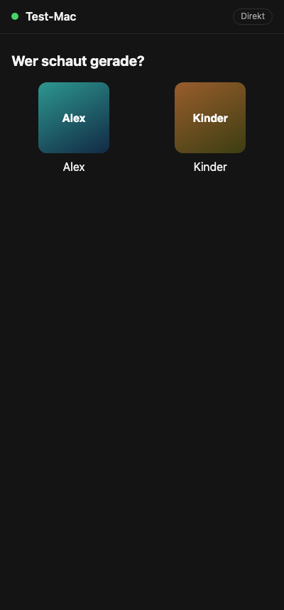
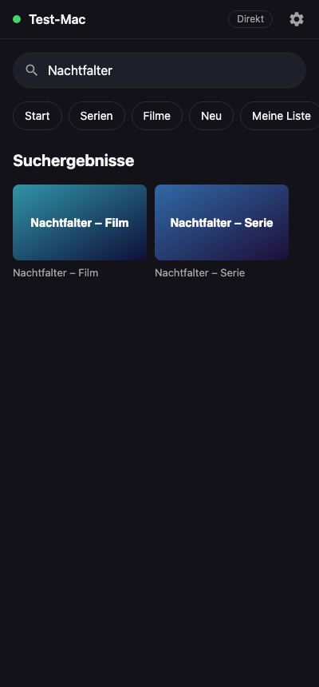
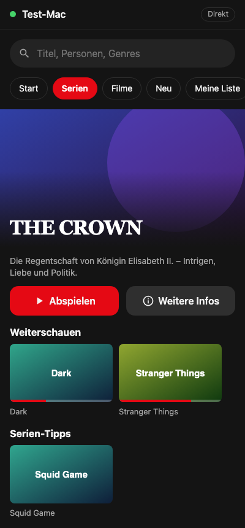
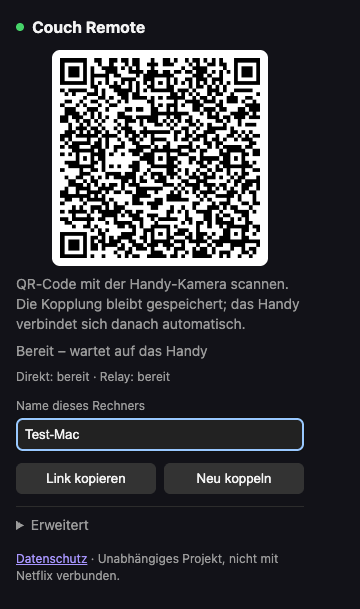
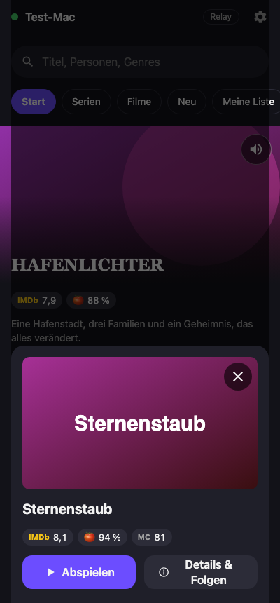
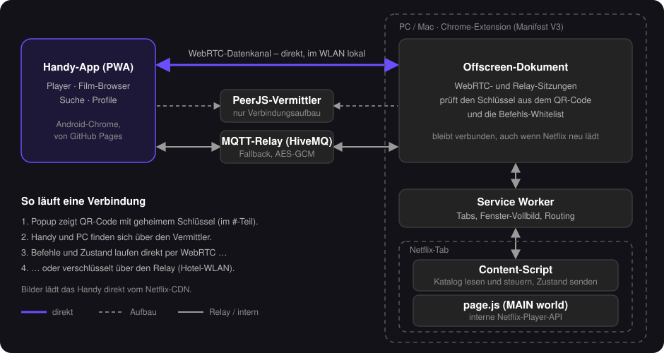

# Couch Remote

Netflix läuft in Chrome auf PC oder Mac, das Android-Handy ist die Fernbedienung – für den Player
und für die Auswahl von Filmen und Serien. Nur eine Chrome-Extension und eine Web-App, kein Konto,
kein eigener Server.

> Couch Remote ist ein unabhängiges Open-Source-Projekt und nicht mit Netflix, Inc. verbunden,
> von Netflix unterstützt oder beauftragt. Netflix ist eine Marke von Netflix, Inc.

<p align="center">
  
  &nbsp;
  
  &nbsp;
  
</p>

<sub>Screenshots aus dem automatischen Test mit nachgebauter Netflix-Seite; Titel und Bilder sind Platzhalter.</sub>

## Funktionen

**Film-Browser auf dem Handy**
- Profilauswahl („Wer schaut gerade?“)
- Die große Netflix-Empfehlung oben auf Start, Serien, Filme … über die ganze Breite, direkt abspielbar (am PC läuft ihr Trailer)
- Reihen wie „Weiterschauen“ oder „Derzeit beliebt“ mit Bildern und Fortschritt, weitere Reihen nachladen
- Bereiche Start, Serien, Filme, Neu und Meine Liste – der aktive Bereich ist rot markiert, auch wenn am PC navigiert wird
- Suche über die Handy-Tastatur
- Titel antippen → „Abspielen“ oder „Details & Folgen“ mit Beschreibung, Staffelwahl und Folgenliste
- Ton der Trailer-Vorschauen (Empfehlung, Details) vom Handy aus- und einschalten
- Optional Bewertungen von IMDb, Rotten Tomatoes und Metacritic (mit eigenem, kostenlosem OMDb-Schlüssel, siehe unten)
- Bleibt die Übersicht leer: „Diagnose anzeigen“ zeigt, wie die Extension die Netflix-Seite sieht

**Player**
- Play/Pause, ±10 Sekunden, Zeitleiste zum Springen
- Wiedergabe-Tempo 0,5× bis 2×
- Lautstärke (Regler, Leiser/Lauter, Stumm)
- Intro/Rückblick überspringen, nächste Folge
- Tonspur und Untertitel wählen
- Vollbild an/aus, zurück zur Übersicht, Netflix am PC öffnen

**Verbindung**
- Einmal per QR-Code koppeln, danach verbindet sich das Handy automatisch – auch nach Neuladen der Netflix-Seite
- Funktioniert auch in WLANs, die direkte Verbindungen sperren (Hotel, Gäste-WLAN), über einen verschlüsselten Relay
- Mehrere Rechner (z. B. PC und Mac) koppelbar

<p align="center">
  
  &nbsp;
  
  &nbsp;
  
</p>

## Einrichtung

### 1. Extension in Chrome installieren (PC/Mac)

1. Unter [Releases](https://github.com/MacBuchi/netflix-remote/releases/latest) die ZIP-Datei herunterladen und entpacken.
2. `chrome://extensions` öffnen → „Entwicklermodus“ einschalten → „Entpackte Erweiterung laden“ → den entpackten Ordner wählen.

Für ein Update die neue ZIP in denselben Ordner entpacken und bei der Extension auf „Neu laden“ klicken.
Die Kopplung bleibt dabei erhalten.

Selbst bauen statt ZIP: `npm install && npm run build:ext`, dann den Ordner `extension/dist` laden.

**Opera** (und andere Chromium-Browser wie Edge oder Brave): genauso, nur über `opera://extensions`
→ „Entwicklermodus“ → „Entpackte Erweiterung laden“. Der automatische Test läuft auch mit Opera
(getestet mit Opera 135).

### 2. Koppeln



1. In Chrome auf das Extension-Symbol klicken – ein QR-Code erscheint.
2. QR-Code mit der Android-Kamera scannen, der Link öffnet die Fernbedienung
   (`https://macbuchi.github.io/netflix-remote/`).
3. Im Chrome-Menü auf dem Handy „Zum Startbildschirm hinzufügen“ – ab dann startet sie wie eine App.

Unter „Name dieses Rechners“ lässt sich der Rechner benennen, das hilft bei mehreren gekoppelten Rechnern.
„Neu koppeln“ erzeugt einen neuen Schlüssel; alle bisher gekoppelten Handys müssen dann neu scannen.

Oben rechts zeigt die Handy-App, wie sie verbunden ist: „Direkt“ (WebRTC) oder „Relay“.

<br clear="right">

### 3. Bewertungen einschalten (optional)



Die Handy-App kann bei Titeln kompakt die Bewertungen von IMDb, Rotten Tomatoes und Metacritic zeigen –
jeweils die, die bekannt sind. Sie kommen vom Dienst [OMDb](https://www.omdbapi.com/); jeder Nutzer braucht
dafür einen eigenen, kostenlosen Schlüssel (1.000 Abfragen pro Tag):

1. Auf [omdbapi.com/apikey.aspx](https://www.omdbapi.com/apikey.aspx) „FREE“ wählen und die E-Mail-Adresse eintragen.
2. Den Aktivierungslink in der E-Mail anklicken.
3. In der Handy-App oben rechts auf das Zahnrad tippen, den Schlüssel eintragen und „Speichern & testen“ tippen.
   Die App schlägt zur Probe einen bekannten Film nach und meldet „✓ Funktioniert …“ oder, was nicht stimmt.
   Einfacher: den Beispiel-Link aus der E-Mail (`…?i=tt3896198&apikey=…`) komplett einfügen – die App nimmt
   den Schlüssel heraus und testet ihn sofort.

Die Schritte und der Link zu OMDb stehen auch direkt in den Einstellungen der App.

Die App fragt nur beim Öffnen eines Titels (Titel-Blatt, Details, Empfehlung) und merkt sich die Antworten
eine Woche. Weil Netflix deutsche Titel zeigt, die bei IMDb oft anders heißen, ordnet die App zuerst über
[Wikidata](https://www.wikidata.org/) die Netflix-Nummer der IMDb-Nummer zu. Kennt Wikidata die Nummer nicht, sucht
die App den deutschen Namen unter den Bezeichnungen der Filme und Serien bei Wikidata; tragen mehrere Werke diesen
Namen, entscheiden Film oder Serie und das Erscheinungsjahr aus den Details. OMDbs eigene Titelsuche kommt nur
noch mit Jahr zum Zug. Unter den Bewertungen steht, welchem Werk sie gehören („The Innocents (2016)“), so fällt
eine falsche Zuordnung sofort auf. Findet sich nichts, steht dort „Keine Bewertungen gefunden“.

<br clear="right">

## So funktioniert es

<p align="center"></p>

- **Verbindung:** Handy und PC finden sich über den öffentlichen PeerJS-Server (kein Konto nötig) und
  sprechen dann direkt per WebRTC miteinander – im selben WLAN bleiben die Befehle im lokalen Netz.
  Die Verbindung hängt am Offscreen-Dokument der Extension, nicht am Netflix-Tab, und übersteht deshalb
  Neuladen und Seitenwechsel.
- **Gesperrte WLANs (Hotel, Gäste-WLAN):** Parallel läuft immer ein Relay-Weg über einen öffentlichen
  MQTT-Server (HiveMQ). Die Nachrichten sind mit dem Schlüssel aus dem QR-Code Ende-zu-Ende verschlüsselt
  (AES-GCM), auch die Themen-Namen sind daraus abgeleitet; der Server sieht nur Datensalat. Große
  Nachrichten (etwa der Katalog) werden in Teile zerlegt, weil öffentliche Server die Größe begrenzen.
  Klappt die Direktverbindung, wechselt die App automatisch darauf.
- **Sicherheit:** Der QR-Code enthält einen geheimen Schlüssel im `#`-Teil der Adresse – der geht nie an
  einen Webserver, und die App entfernt ihn nach dem Koppeln aus der Adresszeile. Ohne ihn nimmt die
  Extension keine Befehle an; erlaubt sind nur die festen Befehle aus `shared/protocol.ts` (`parseCommand`).
- **Film-Browser:** Die Extension liest, was Netflix am PC anzeigt – Links auf `/watch/…`, `/title/…` oder
  `?jbv=…`, `aria-label`, Bilder – und schickt es als Liste ans Handy; Aktionen werden am PC ausgeführt.
  Die Bilder lädt das Handy direkt vom Netflix-CDN. Den aktiven Bereich leitet das Handy aus der Adresse
  des Netflix-Tabs ab.
- **Netflix-Steuerung:** über die interne Player-API von Netflix (`page.js` in der MAIN world), mit
  Rückfall auf das `<video>`-Element und die `data-uia`-Schaltflächen. Alle Netflix-Selektoren stehen in
  `extension/src/netflix/selectors.ts`.
- **Vollbild:** Echtes Vollbild braucht in Chrome einen Klick am PC; stattdessen schaltet die Extension das
  Browserfenster in den Vollbildmodus – Netflix füllt es komplett aus.
- **Handy-Lautstärketasten** kann eine Web-App nicht abfangen; die Lautstärke wird über die App geregelt.

Eigene Server lassen sich im Popup unter „Erweitert“ eintragen: Adresse der Handy-App, PeerJS-Vermittler
(`npx peerjs --port 9000`, von der Handy-App aus per `wss://` erreichbar, weil die App über HTTPS läuft)
und MQTT-Relay.

## Wenn etwas nicht klappt

| Problem | Lösung |
|---------|--------|
| Übersicht leer, Einträge falsch oder unpassend | In der Handy-App Zahnrad → „Hilfe bei Problemen“ → „Diagnose anzeigen“ → „Kopieren“ und als [Issue](https://github.com/MacBuchi/netflix-remote/issues) melden (bei leerer Übersicht steht der Knopf auch direkt dort). Netflix hat dann vermutlich das Seiten-Markup geändert; anzupassen ist `extension/src/netflix/selectors.ts`. |
| „Netflix-Seite antwortet nicht“ | Netflix-Tab neu laden – nach einem Update der Extension ist das alte Content-Script abgekoppelt. |
| Handy verbindet sich nicht | Im Popup muss „Direkt: bereit · Relay: bereit“ stehen. Sonst Internetverbindung des PCs prüfen oder unter „Erweitert“ andere Server eintragen. |
| „Kopplung ungültig“ | Im Popup wurde „Neu koppeln“ gedrückt; QR-Code neu scannen. |

## Projektstruktur

| Ordner | Inhalt |
|--------|--------|
| `shared/` | Nachrichtenprotokoll Handy ↔ PC mit Befehls-Whitelist, Kopplungs-Link, verschlüsselter Relay |
| `extension/src/` | Chrome-Extension (Manifest V3, TypeScript, esbuild): `offscreen.ts` (Verbindungen), `background.ts` (Service Worker), `content.ts`, `page.ts` (MAIN world) |
| `extension/src/netflix/` | Alles, was das Netflix-Markup kennt: `selectors.ts`, `catalog.ts`, `player.ts`, `page-kind.ts` |
| `remote/` | Handy-App (PWA, Preact, Vite) |
| `tests/unit/` | Unit-Tests (Vitest, jsdom) |
| `tests/e2e/` | End-to-End-Test: echte Extension + Handy-App + lokaler PeerJS- und MQTT-Server + nachgebaute Netflix-Seite (`fake-netflix.html`) |
| `docs/img/` | Bilder für diese Dokumentation |

## Entwicklung

```bash
npm install
npm run typecheck
npm test                  # Unit-Tests
npm run build             # extension/dist + remote/dist
npm run test:e2e          # braucht vorher npm run build
npm run dev:remote        # Handy-App lokal (im WLAN erreichbar)
npm run docs:screenshots  # baut, testet und erneuert die Screenshots in docs/img

# E2E mit einem anderen Chromium-Browser auf der PC-Seite, z. B. Opera:
E2E_BROWSER=/Applications/Opera.app/Contents/MacOS/Opera npm run test:e2e
```

Der E2E-Test fährt Chrome mit der gebauten Extension und steuert die Handy-App in einem zweiten Browser –
direkt per WebRTC und über den Relay in einem simulierten Hotel-WLAN. Netflix wird durch
`tests/e2e/fake-netflix.html` ersetzt, das die Player-API, die `data-uia`-Haken und das Katalog-Markup
nachbildet. Ändert sich das echte Netflix-Markup, gehören Nachbildung und `tests/unit/catalog.test.ts`
mit angepasst. Für die Screenshots zeichnet der Test Platzhalter-Poster statt der Netflix-Bilder.

### Veröffentlichen

`version` in `extension/static/manifest.json` (und `package.json`) erhöhen und per Pull Request nach
`main` mergen. Dann laufen automatisch:

- **Release** – legt Tag `vX.Y.Z` und ein GitHub-Release mit der Extension-ZIP an, wenn die Version neu ist.
- **Deploy phone app** – baut die Handy-App und veröffentlicht sie auf GitHub Pages
  (einmalig einzurichten: Repo → Settings → Pages → Source: **GitHub Actions**).

## Rechtliches

- **Datenschutz:** [macbuchi.github.io/netflix-remote/privacy.html](https://macbuchi.github.io/netflix-remote/privacy.html)
  (Quelle: `remote/public/privacy.html`) – kein Konto, kein Tracking, der Entwickler erhält keine Daten;
  dort sind die beteiligten öffentlichen Server aufgeführt.
- **Lizenz:** MIT, siehe [LICENSE.md](LICENSE.md). Jeder Build enthält `THIRD_PARTY_LICENSES.txt` mit den
  Lizenzen der gebündelten Bibliotheken (erzeugt von `scripts/third-party-licenses.mjs`).
- **Name und Gestaltung:** bewusst ohne „Netflix“ im Namen und ohne Netflix-Farben; Netflix wird nur genannt,
  um zu beschreiben, womit die Extension funktioniert. Die Screenshots zeigen erfundene Titel.
- Die Extension überträgt kein Video und umgeht keinen Kopierschutz; sie steuert nur die eigene Sitzung.

Ursprünglich ein Fork von [butttons/netflix-remote](https://github.com/butttons/netflix-remote) (MIT).
Die Planung und offene Punkte stehen in [PLAN.md](PLAN.md).
